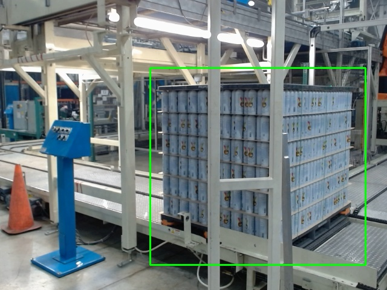

# Can Detector — Real-Time Object Detection with Active Learning

A complete machine learning pipeline for training and deploying a real-time object detector, built around PyTorch's Faster R-CNN. The system is designed around an **active learning loop**: capture data from a live camera, annotate it, train a model, run inference, and continuously feed high-confidence detections back into the training set to improve the model over time.

---

## Overview

This project demonstrates the full ML lifecycle for a practical computer vision problem:

1. **Capture** — motion-triggered dataset collection from a live camera feed
2. **Annotate** — interactive bounding box editor for correcting or relabeling captures
3. **Train** — fine-tune a Faster R-CNN (ResNet-50 FPN backbone) on your dataset
4. **Detect** — run live inference and optionally auto-save high-confidence frames back to the dataset

The result is a self-improving detection system that gets better the more it runs.

---

##Example


---

## Architecture

```
capture_motion_dataset.py   →   dataset/flat/        (raw frames)
                                dataset/labels/      (bounding boxes as x1 y1 x2 y2)
                                dataset/boxed/       (preview images with drawn boxes)
                                        ↓
box_corrector.py            →   interactive re-annotation of existing samples
                                        ↓
train_torch_detector.py     →   models/frcnn_best.pth
                                        ↓
run_can_detector.py         →   live inference + optional autosave back to dataset
```

---

## Scripts

### `capture_motion_dataset.py` — Motion-Triggered Data Collection

Uses OpenCV's MOG2 background subtractor to detect moving objects and automatically save annotated frames at a configurable rate. Includes black-region suppression to reduce false positives from dark backgrounds.

**Key features:**
- Auto-scans for available cameras or uses a preferred index
- Configurable motion sensitivity, minimum contour area, and save cooldown
- `s` — manually save a positive sample
- `n` — save a negative (no-object) sample
- `q` / `ESC` — quit

```bash
python capture_motion_dataset.py
```

---

### `box_corrector.py` — Bounding Box Annotation Tool

An interactive OpenCV-based annotator for reviewing and correcting bounding boxes on existing dataset images. Iterates through every image in `dataset/boxed/`, loads the corresponding flat image and label, and lets you draw a new box or clear the existing one.

**Controls:**
| Key | Action |
|-----|--------|
| Drag | Draw new bounding box |
| `s` | Save box and advance |
| `x` | Clear current box |
| `n` / `p` | Next / previous image |
| `q` / `ESC` | Quit |

```bash
python box_corrector.py
```

---

### `train_torch_detector.py` — Model Training

Fine-tunes a pretrained Faster R-CNN (ResNet-50 FPN) on your captured dataset. Handles train/val splitting automatically and saves the best checkpoint by validation loss.

**Key details:**
- Uses ImageNet-pretrained backbone weights for fast convergence
- 80/20 train/val split (reproducible via seed; splits are cached to `dataset/splits/`)
- Horizontal flip augmentation during training
- AdamW optimizer, configurable LR and epochs
- Saves best model to `models/frcnn_best.pth`

```bash
python train_torch_detector.py
```

Default hyperparameters (edit in `main()`):

| Parameter | Default |
|-----------|---------|
| Epochs | 12 |
| Batch size | 2 |
| Learning rate | 1e-4 |
| Weight decay | 1e-4 |
| Val fraction | 0.20 |

---

### `run_can_detector.py` — Live Inference

Loads the trained model and runs real-time detection on a camera feed. Includes exponential smoothing for stable bounding boxes and an autosave mode that feeds high-confidence detections back into the training dataset.

**Key features:**
- Configurable score threshold and autosave threshold
- Box smoothing across frames to reduce jitter
- `a` — toggle autosave mode (saves frames where score ≥ threshold)
- `s` — manually save current detection as a positive sample
- `n` — save current frame as a negative sample
- `q` / `ESC` — quit

```bash
python run_can_detector.py
```

---

## Dataset Format

All data lives under a `dataset/` directory with three subdirectories:

```
dataset/
├── flat/        # Raw captured frames (JPEG)
├── labels/      # One .txt per image: "x1 y1 x2 y2" or empty for negatives
└── boxed/       # Preview images with bounding boxes drawn
```

Labels use absolute pixel coordinates in `x1 y1 x2 y2` format. An empty label file indicates a negative (background-only) sample.

---

## Requirements

```
torch
torchvision
opencv-python
numpy
Pillow
```

Install with:

```bash
pip install torch torchvision opencv-python numpy Pillow
```

GPU training is strongly recommended but not required — the training script automatically uses CUDA if available.

---

## Quickstart

```bash
# 1. Collect initial training data (run for a few minutes, move the object around)
python capture_motion_dataset.py

# 2. (Optional) Review and correct bounding boxes
python box_corrector.py

# 3. Train the model
python train_torch_detector.py

# 4. Run the detector — enable autosave with 'a' to keep improving the dataset
python run_can_detector.py
```

Repeat steps 1 → 3 (or just 3) as you accumulate more autosaved data to iteratively improve model accuracy.

---

## Model

The detector uses **Faster R-CNN with a ResNet-50 FPN backbone**, fine-tuned for a two-class problem (background + target object). The backbone is initialized from ImageNet pretrained weights; only the box predictor head is replaced for the custom class count.

This architecture provides a strong accuracy/speed tradeoff for single-object desktop detection scenarios and is robust enough to generalize from relatively small datasets when combined with the active learning loop described above.

---

## Project Structure

```
├── capture_motion_dataset.py   # Data collection
├── box_corrector.py            # Annotation correction tool
├── train_torch_detector.py     # Model training
├── run_can_detector.py         # Live inference + autosave
├── dataset/                    # Created automatically
│   ├── flat/
│   ├── labels/
│   ├── boxed/
│   └── splits/
└── models/                     # Created automatically
    └── frcnn_best.pth
```
